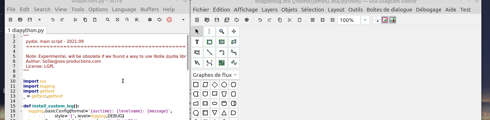

# python-dia

A library for producing and manipulating
[Dia diagrams](http://dia-installer.de/) files.

## Demo



## Installation

1) Prerequisite is Dia with python3 compiled. By default is with 2.7 so you will have to upgrade dia
I have to compile dia from source on my side. on debian based,

a) Install depencies

```sh

#http://dia-installer.de/howto/compile_msvc/index.html.en#compilation

#If none of the above sources contain information to solve your problem, 
# contact the author of this document: Steffen Macke <sdteffen@gmail.com>

#Ubuntu

#Starting from a vanilla Ubuntu 12.04 deskop installation, you can install
#the necessary packages using the following command:

sudo apt-get install autoconf automake autotools-dev git git-core gsfonts-x11 \
intltool libatk1.0-dev libcairo-gobject2 libcairo2-dev liberror-perl \
libexpat1-dev libfontconfig1-dev libfreetype6-dev libgdiplus \
libgdk-pixbuf2.0-dev libgif4 libglib2.0-bin libglib2.0-dev \
libgtk2.0-dev libice-dev libltdl-dev libmono-accessibility2.0-cil \
libmono-data-tds2.0-cil libmono-messaging2.0-cil libmono-sqlite2.0-cil \
libmono-system-data2.0-cil libmono-system-messaging2.0-cil \
libmono-system-web2.0-cil libmono-wcf3.0-cil \
libmono-winforms2.0-cil libmono2.0-cil libpango1.0-dev libpixman-1-dev \
libpng12-dev libpthread-stubs0 libpthread-stubs0-dev libsm-dev libsqlite0 \
libssl-dev libtool libx11-dev libxau-dev libxcb-render0-dev libxcb-shm0-dev \
libxcb1-dev libxcomposite-dev libxcursor-dev libxdamage-dev libxdmcp-dev \
libxext-dev libxfixes-dev libxft-dev libxi-dev libxinerama-dev libxml2-dev \
libxrandr-dev libxrender-dev m4 python-sip python2.7-dev swig \
x11proto-composite-dev x11proto-core-dev x11proto-damage-dev x11proto-fixes-dev \
x11proto-input-dev x11proto-kb-dev x11proto-randr-dev x11proto-render-dev \
x11proto-xext-dev x11proto-xinerama-dev xtrans-dev zlib1g-dev libart-2.0-dev

# requires libgraphene 1.10
# follow steps at https://www.linuxfromscratch.org/blfs/view/svn/x/graphene.html

sudo apt-get install libxslt1-dev

#Clone the git repository, for example:
#git clone git://git.gnome.org/dia --> does not exist anymore
#git clone https://github.com/GNOME/dia
#or use debian way:
#apt-get source dia

#Enter the dia directory and start the build process using the following commands:

cd dia-0.97.3+git20160930

./autogen.sh
PYTHON="/usr/bin/python3.9" ./configure --prefix=/usr --with-python --with-swig --with-libart
```
b) Fix errors

>> Provocates Error
checking if Python version >= 2.3.0... configure: error: too old

<< REPLACE in configure
        prog="
import sys, string
minver = '2.3.0'
pyver = string.split(sys.version)[0]  # first word is version string
# split strings by '.' and convert to numeric
minver = map(string.atoi, string.split(minver, '.'))
if hasattr(sys, 'version_info'):
    pyver = sys.version_info[:3]
else:
    pyver = map(string.atoi, string.split(pyver, '.'))
# we can now do comparisons on the two lists:
if pyver >= minver:
        sys.exit(0)
else:
        sys.exit(1)"

>> BY
 prog="
import sys, string
if sys.version_info >=(2,3,0): 
        sys.exit(0)
else:
        sys.exit(1)"

==>> Provocates configure script broken
checking if Python version >= 2.3.0... okay
checking local Python configuration...   File "<string>", line 1
    import sys; print sys.version[:3]
                      ^
<< FIX 
  PYTHON_VERSION=`$PYTHON -c "import sys; print sys.version[:3]"`
>> BY
 PYTHON_VERSION=`$PYTHON -c "import sys; print(sys.version[:3])"`

==>> Provocates SyntaxError: invalid syntax
  File "<string>", line 1
    import sys; print sys.platform

<< FIX 
  PYTHON_PLATFORM=`$PYTHON -c "import sys; print sys.platform"`
>> BY
  PYTHON_PLATFORM=`$PYTHON -c "import sys; print(sys.platform)"`
                      ^

e) compil
 ```sh
make
```
To install, run the following command:
```sh
make install
```

==>get rid of pdf buggy plugin

 ```sh
meson setup --wipe build --prefix=/usr --buildtype=release 
#Desactive the buggy pdf, by editing plug-ins/meson.build 
#  and comment the line pdf to have #subdir('pdf')
meson setup  build --reconfigure -Dwith-python=yes
cd build &&meson --prefix=/usr --buildtype=release .. && ninja
```

==> Solve networ/network redundancy error: 
#in /usr/share/dia/shapes if you have both network and Network folders
#move files from network into Nework and remove network, it 


2) Then pythondia installation can be done

-from pip (complicated with dia) 

python3 --version gives ; Python 3.x.y , replace x with your numer in the following script:

```sh
sudo pip3 install pythondia==0.7.1
cd ~/.dia/python
cp /usr/local/lib/python3.x/site-packages/pythondia-0.7.1-py3.x.egg/* .
rm -r EGG-INFO
```
-from github (more straight forward = RECOMMENDED):

```sh
cd ~/.dia/python
git clone https://github.com/sosie-js/python-dia pythondia
cp pythondia/tests/diapython.py .
```

## Documents

Example python script file that can be run ONLY IN DIA

#---------- SCRIPT CANVAS ------------------

BOOT_LOADER

def dia_debug_show_diaobjs (data, flags) :

    SCRIPT

END_LOADER

dia.register_action ("DebugShowDiaObject", _("Dia _Object Factory Helper"),
                         "/DisplayMenu/Debug/DebugExtensionStart",
                         dia_debug_show_diaobjs)

#------------------------------------

where:


SCRIPT is one of the cases:

#Case 1 : Non Wrapped Objectypes in a class

```py
   
    errors = []
    
    error, dot=DiaObjectFactoryHelper("UML - Note", name="MyNote",cx=15,cy=0)
    if error  :
        errors.append(error)
    else :
        #---- Customize you dia object here:
        dot.set_property("text","Here are the two Dia Object Types created with me")
        #------
        dot.dump_properties()
        dot.add_to_layer(layer)

```

#Case 2 ; Here are some wrapped Dia Objectypes in class

```py

    db=DIA_Database_Table("Stars2",cx=10,cy=10)
    db.add_attribute("MI-6","secretAgent","JB007","License To Kill",1,0,0) 
    db.add_attribute("Office","Inspector","Columbo","License To Investigate",0,1,0) 
    db.dump_properties()
    db.add_to_layer(layer)
        
    ud=DIA_UML_Class("PyDia", cx=20,cy=10)
    ud.add_template("asterix", "le gaulois")
    ud.add_attribute("game",type="string",value="sizigi",comment="",visibility=0,abstract=0,class_scope=0)
    operation=ud.add_operation("work", "result", comment='', stereotype='', visibility=0, inheritance_type=2, query=0,class_scope=0, params=())
    operation.add_param('time', type="minutes", value="180", comment="Professional work", pindir=0)
    ud.dump_properties()
    ud.add_to_layer(layer)
```

#Case 3 : CSV

Each row follows the scheme : 
 `name , property_name(1) , property type(2); property value, property comment`

  with the first line (1) is the optional coord of the object else (0,0) and (2) is the sheet's name 

```py

   Database_Table="""
    Database - Table;(10,20);Database;;DiaObject of type "Database - Table"
    Database - Table;obj_pos;point;(14.4,10.45);
    Database - Table;obj_bb;rect;((14.4,10.45),(20.32,21.5));
    Database - Table;meta;dict;{'url': 'm_url', 'id': 'm_id', 'modification': 'm_modification', 'creation': 'm_creation', 'author': 'm_author'};
    Database - Table;elem_corner;point;(14.4,10.45);
    Database - Table;elem_width;real;5.92;
    Database - Table;elem_height;real;11.05;
    Database - Table;name;string;c_name;
    Database - Table;comment;string;c_desc;
    Database - Table;visible_comment;bool;1;
    Database - Table;underline_primary_key;bool;1;
    Database - Table;tagging_comment;bool;0;
    Database - Table;bold_primary_keys;bool;0;
    Database - Table;attributes;darray;(('a_name', 'a_type', 'a_desc', 0, 0, 0, '(NULL)'), ('', '(NULL)', 'primary', 1, 0, 0, '(NULL)'), ('(NULL)', '(NULL)', 'nullable', 0, 1, 0, '(NULL)'), ('(NULL)', '(NULL)', 'unique', 0, 0, 1, '(NULL)'), ('(NULL)', '(NULL)', 'default', 0, 0, 0, 'a_value'));
    Database - Table;normal_font;font;monospace normal normal;
    Database - Table;name_font;font;sans 700 normal;
    Database - Table;comment_font;font;sans normal italic;
    Database - Table;normal_font_height;real;0.8;
    Database - Table;name_font_height;real;0.7;
    Database - Table;comment_font_height;real;0.7;
    Database - Table;text_colour;colour;(0.0,0.0,0,0,1,0);
    Database - Table;line_colour;colour;(0.0,0.0,0.0,1.0);
    Database - Table;fill_colour;colour;(1.0,1.0,1.0,1.0);
    Database - Table;line_width;length;0.1;
    """
    ud=DIA_CSV_parser("UML - Class").parse_data(Database_Table)
    ud.dump_properties()
    ud.add_to_layer(layer)
    
    ud=DIA_CSV_parser("Database - Table").parse_data(Database_Table)
    ud.move(2.5,25)
    ud.dump_properties()
    ud.add_to_layer(layer)

```

BOOT_LOADER is at the top of your script

```py

import sys 

import logging
import gettext
_ = gettext.gettext

def install_custom_log():
    logging.basicConfig(format='{asctime}: {levelname}: {message}',
                        style='{', level=logging.DEBUG)
    logging.Formatter.default_msec_format = '%s.%03d'
    
def install_shared_module():
    with open("_once.py", 'w') as outfile:
        outfile.write("#Class holder containing imports to prevent circular imports\n")
        outfile.write("imported={}")

def check_versions() -> bool:
    from pkg_resources import get_distribution
    from platform import python_version

    failed = False

    if sys.version_info < (3, 9, 0, 'final', 0):
        logging.warning('pythonDia is not tested on Python versions prior to 3.9, but you have {} {}. Use at your own risk.'
                        .format(python_version(), sys.version_info.releaselevel))
        failed = True
        
    return failed
    
import json

import jsonpickle
from json import JSONEncoder

def json_dump(dump):
    """
        json_dump for any object, solve serializablelisable issue 
        NOTE: tuples are not handled, any invalid value cleared
        Adapted from https://pynative.com/make-python-class-json-serializable/
    """
    #Encode Object into JSON formatted Data using jsonpickle")
    dumpJSON = jsonpickle.encode(dump, unpicklable=False)
    #Ensures Json beautification will work
    obj=json.loads(dumpJSON)
    #Writing JSON Encode data into Python String")
    dumpJSONData = json.dumps(obj, indent=4)
    return dumpJSONData
    
```


END_LOADER is at the end of your script

```py


import inspect
 
install_custom_log()
 
check_versions() 

install_shared_module()
 
def onDiaLaunched():
    stack=inspect.stack()
    return ("python-startup.py" in stack[-1][1])

import _once
if __name__ == '__main__' or not onDiaLaunched():
   
    print("This free version does not have the dia core, you can only trigger from dia, sorry")

else:
    def whoami():
        stack=inspect.stack()
        return json_dump(stack[-1][1])
    
    if("dia" in globals()):
        print("DIA(G)"+__name__ )
    else:
        print("----------\nDIA"+__name__+":"+whoami()+"="+str(onDiaLaunched())+"\n----------")
        import dia
                      
    _once.imported['dia']= dia
    
    #==== SoS extension ====
    
    # Core (DON'T TOUCH THESE TWO LINES!)
    from pythonDia.objects.UML.Class import DIA_UML_Class
    from pythonDia.ObjectHelpers import DiaObjectFactoryHelper
   
    # Extras
    from pythonDia.objects.Database.Table import DIA_Database_Table
   
    # Should be the last
    from pythonDia.ObjectHelpers import DIA_CSV_parser
    
    #=================

```


## Limitations

* This free version does provide pythondia access only to objects. 
Thus, you have to use the dia api to run the meaning on each code change,
meaning you will have to close , open dia and watch errors on console to fix the 
script. Invalid scripts will not be accessible from dia app.

* For now, only objects UML Class and Database Table are supported

## Contributing

Feel free to add other object and fixes.

## Development

### Compile .egg

```shell
$ ./package.sh
```

### Upload to PyPI

1. Create an API Token from the Web UI. (Edit your `~/.pypirc` with the generated token.)
2. Install Twine
```shell
$ python3 -m pip install --user --upgrade twine
```
3. Upload the bundle
```shell
$ python3 -m twine upload dist/*
```

Note: The upload to PyPI is currently assured by GitHub Actions.


### Release

1. Increase the version number in `setup.py`.
2. Commit and push.
3. Create a new tag in GitHub to trigger the CI pipeline.

